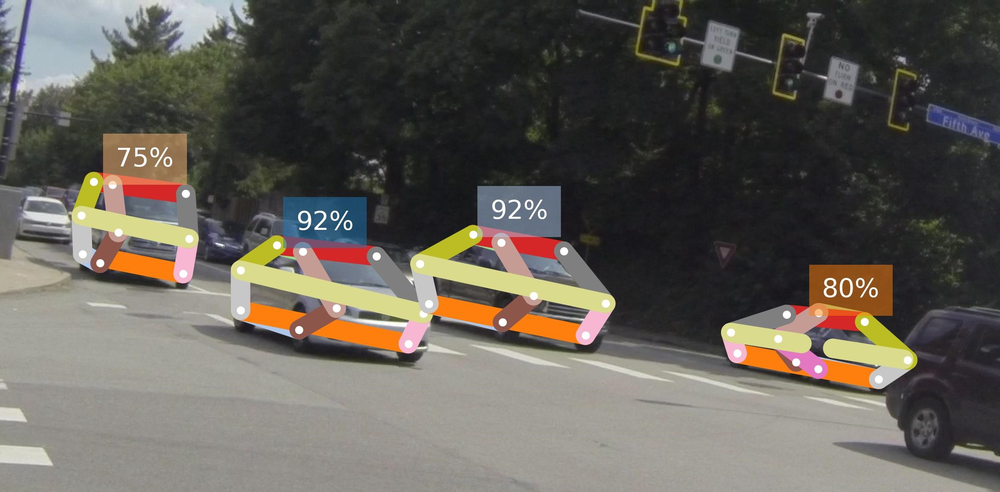

# 2DCarPoseEstimation-Group57
2DCarEstimation with HR Former and shufflenet backbone in openpifpaf with Carfusion dataset


# Introduction

This project aims to use machine learning and specifically state-of-the-art models in order to estimate vehicle's 2D positions on images and further on videos. This problem is very important in the autonomous vehicles' world and is therefore crucial in general.
A 2D pose estimation model takes as input either and image or a video consisting of frames and outputs the pixel positions of each keypoint on the image. This can be used to visualize the frame of a car or further to transform these keypoints into 3D keypoints and model for a fully developped environment.

Two of the main models that have been developped and that we decided to focus on are OpenPifPaf and Occlusion-Net. The first can be used for various purposes such as human pose estimation but in this case also vehicle pose estimation. The second one is specifically used for vehicles and one of its main uses is to first find the visible keypoints of a car and then from these keypoints, find the occluded ones.

Our main goal in this project was to merge these two models such that anything inputted in OpenPifPaf would result in visible keypoints that would then be used in the second model to find the full position of the vehicles.

Sadly, working with Occlusion-Net has proven to be way more difficult than we thought it would be, and therefore we had to resize our project and end it before the full implementation. The code of the Occlusion net was not very well documentate and the Issues on the github was gave up since years. 

We decided to concentrate our effort to a code with a better documentation: Openpifpaf

# Contribution Overview

We have integrated the use of the OpenPifPaf code in our work, enhancing it by incorporating a High Resolution (HR) Transformer into the backbone of our algorithm. Further, we have modified the dataset to ensure a comprehensive representation of vehicles. This includes not just the visible parts, but also those parts that are typically obscured, thereby enabling a more accurate and holistic understanding of the subject.


HRFormer is an architecture in machine learning that has been created recently and consists of a network branching out into multiple parallel lines. It is said to reduce both computational cost and memory and results in good performances when tested on the COCO dataset.
It can and has been used for human pose estimation, segmentation and classification. Implementation of the HR-Former backbone has been possible thanks to the code available here: https://github.com/HRNet/HRFormer


Our first objective to add the Occlusion-Net model with a trifocal tensor loss was too complicated to implement, due to the multiple interactions between each part of the model that made the modification of a part very complicated for us.


In the preparation of our goal, we implemented a CarFusion plugin in OpenPifPaf and an additional Backbone to test our Occlusion-Net model, which sadly had to be dropped out of the project.


# Experimental Setup


We decided to find the best model backbone to adapt with the new dataset that we decided to use (see info below) so we took our attention to the shufflenet of openpifpaf and the hr-former architecture. We made some training runs with these two backbones and we evalutated them with a testset to find the best one to continue with. We used checkpoints of these different models as initial values to start training our models, so the model doesn't start with random weights and can perform better and more easily, and it just needs to understand our heads.

To know wich model is the best, we used some metrics:

The keypoint detection task COCO is scored like an object detection task, with average precision (AP) and average recall (AR)

- Average Precision (AP):
AP measures the accuracy and precision of the model's predictions for a specific category, such as a keypoint or an object class. It calculates the precision at different levels of recall by varying a threshold for considering a prediction as a true positive. AP ranges from 0 to 1, where a higher value indicates better performance. 
- Average Recall (AR):
AR measures the model's ability to detect instances of a specific category at various levels of precision. It calculates the recall at different levels of precision by varying a threshold for considering a prediction as a true positive.

AP and AR are in range from 0 to 1, where a higher value indicates better performance.


 - We also used the Mean Pixel Error and Detection Rate to choose the best model, which both have to do with the amount of cars detected in an image and the error between a found keypoint and its real position.


# Dataset

We use the dataset used in Occlusion-Net, CarFusion, that consists of 5 videos of cross street intersection with cars running through it and from which frames have been turned into jpg images and annotated.

This results in about 50'000 images and about twice as many cars visible.
Theses images have been annotated with 14 keypoints, some being visible and also the others being occluded.

The keypoints represent the 4 wheels, 4 lights, 4 roof corners of the car and the exhaust and center point. These two last points, although they are annotated, are not shown in the skeletons of the cars found, such as seen below:


<sup>image from the website of Carfusion dataset website (https://www.cs.cmu.edu/~ILIM/projects/IM/CarFusion/cvpr2018/index.html</sup>


In order to use this dataset, the firt step is to download it and then to transfer it to COCO format, which will be easier to work with.

## 1. Download dataset

 - First we need to download the dataset and unzip it.

The links to the data are:

Craig Sequence

Part1: https://drive.google.com/opend=1L2azKaYabCQ0YWwGTnN0_uhNgnlACigM

Part2: https://drive.google.com/open?id=1Z15rX038FyRW62DOPEJW16bZZIj8LPC0

Fifth Sequence

Part1: https://drive.google.com/open?id=1W0Ty7vZbnAGyvf0RNeVXcNJV6e7kcqzZ

Part2: https://drive.google.com/open?id=1T253FkwEfKEJyegHNztRPQX_bSjZUznf

Morewood Sequence

Part1:https://drive.google.com/open?id=1uuDYPidIztuOHbDbP2hQv_ocGAnWPbGJ

Part2: https://drive.google.com/open?id=1R3xpUKjHPFOlOj8SZIV9hmtndFMw95iX

Butler Sequence

Part1: https://drive.google.com/open?id=1goDsHDSU5dkJFoy0phTFD2brXf4Ou6sL

Part2: https://drive.google.com/open?id=1AOFQrLQTkNs1djnfI7y-ZeeZQeqnHNQK

Penn Sequence

Part1: https://drive.google.com/open?id=1dYqJtokx1pMEtWH8XK9b_R481jv2ypn2

Part2: https://drive.google.com/open?id=12vSzUh_e3oMYVKewUeEzn9Gv3P_wnGYi


This data can be very memory-heavy so we advise you not to download and use all of it unless it is required.

Once downloaded, the data should be moved into src/openpifpaf/dataCarFusion/[train, test] as needed.

The full dataset weighs 32 Gb and should be split into two: the Craig, Fifth, Morewood and Butler should be used as training set wheras the Penn dataset should be used as testing.
Other ways to split the dataset can be to use only the first half of each dataset and to split them the same way, this results in 16 Gb used.\
You can also only use the first half of the Craig dataset as training and the first half of Butler as testing for a light dataset of 5 Gb.

The final folder should look as follows:

```text
└─dataCarFusion
    └─train
        └─car_craig1
            └───images
                01_0000.jpg
                01_0001.jpg
                ...   
            └───bb
                01_0000.txt
                01_0001.txt
                ...
            └───gt
                01_0000.txt   
                01_0001.txt
                ...
    └─test
        └─car_penn1
            └───images
                01_0000.jpg
                01_0001.jpg
                ...   
            └───bb
                01_0000.txt
                01_0001.txt
                ...
            └───gt
                01_0000.txt   
                01_0001.txt
                ...                
```


## 2. Transform data

Before going further, we advise the user to create a virtual environment with Python 3.7, as it will be used for the data transformation and the project management. We let the user do this freely using either Conda or VirualEnvironment.

Before preprocessing the data, the user install the files as a package using pip with the following command:
```
pip install -e .
```
The packages needed should be installed, but be aware that for some specific uses, for example a backbone that is outside of the scope of this project, there could be extra requirements.

Then, we must transform the dataset so that it uses the Coco format. We have created a file called dataset.py that does the transformation of the images in the dataCarFusion folder.\
This code relies partly on the following github : https://github.com/dineshreddy91/carfusion_to_coco.

This file is located in /src/openpifpaf/, as are any other useful files in this project.


```
pip install -r requirements.txt
python dataset.py --path_dir dataCarFusion/train/ --output_dir dataCarFusion/annotations/ --output_filename car_keypoints_train.json
python dataset.py --path_dir dataCarFusion/test/ --output_dir dataCarFusion/annotations/ --output_filename car_keypoints_test.json
```

You can verify that the code worked correctly by checking if both test and train annotations have been created under src/openpiafpaf/dataCarFusion/annotations/.

# Training

Other important files that can be used are train.py and predict.py, both can be find in /src/openpifpaf/.

The training part of the model can be done with several base networks, datasets and checkpoints.

One example of such use can be seen here:
```sh
python -m openpifpaf.train --dataset carfusionkp --checkpoint=shufflenetv2k16-apollo-24 --carfusionkp-square-edge=513 --lr=0.00002 --momentum=0.95  --b-scale=5.0 --epochs=350 --lr-decay 320 340 --lr-decay-epochs=10  --weight-decay=1e-5 --weight-decay=1e-5  --val-interval 10 --loader-workers 16 --carfusionkp-upsample 2 --carfusionkp-bmin 2 --batch-size 8
```
This perticular command uses our implemented CarFusion dataset with the preexisting ApolloCar 24kps shufflenet checkpoint.

If we want to train the HR-Former model, the command will be:

```sh
python -m openpifpaf.train --dataset carfusionkp --basenet=hrformer_t --hrformer-checkpoint==<path_of_weights> --carfusionkp-square-edge=769 --lr=0.00002 --momentum=0.95  --b-scale=5.0 --epochs=30 --lr-decay 25 27 --lr-decay-epochs=10  --weight-decay=1e-5 --weight-decay=1e-5  --val-interval 1 --loader-workers 16 --carfusionkp-upsample 2 --carfusionkp-bmin 2 --batch-size 8
```

A complete list of general training options and checkpoints can be found here: https://openpifpaf.github.io/cli_help.html

Similarly to other datasets, CarFusion options can be found here:
```
--carfusionkp-train-annotations         Path to train annotations
--carfusionkp-val-annotations           Path to val/test annotations
--carfusionkp-train-image-dir           Path to train images directory
--carfusionkp-val-image-dir             Path to val/test images directory
--carfusionkp-square-edge               Square edge of input images
--carfusionkp-extended-scale            Augment with extended scale range
--carfusionkp-orientation-invariant     Augment with random orientations
--carfusionkp-blur                      Augment with blur
--carfusionkp-no-augmentation           Disable augmentations
--carfusionkp-rescale-images            Rescale factor for images
--carfusionkp-upsample                  Head upsample stride
--carfusionkp-min-kp-anns               Minimum number of keypoint annotations
--carfusionkp-bmin                      bmin
```

Most of these options have default values and do not need to be set if otherwise needed.

# How to run and predict with an image

We have trained a few models that can be used in order to find these keypoints.
The results will be explained further along the document, but in the meantime these checkpoints can be donwloaded here :
https://drive.google.com/drive/folders/1U3Xl_wtkL32DrRsVCbQr12HVaw8iHuJQ?usp=sharing

In order to test these checkpoints on an individual image, one can use the predict function.
The command takes as input the checkpoint required, the directory to the output and of course the input image as parameters.

```sh
python3 -m openpifpaf.predict \
  --checkpoint <path model> \
  --save-all --image-output <path output> \
  <path to image>
```
For a general test of the performances, one can use the eval function with the dataset as parameter and the checkpoint used.

```sh
python3 -m openpifpaf.eval --dataset=carfusionkp --checkpoint <path of the model>
```

For example, we can do: 

```sh
python3 -m openpifpaf.predict \
  --checkpoint model/shufflenet_60epoch.pkl \
  --save-all --image-output all-images/final_image.jpeg \
  voiture.jpg
```

# Results

As said earlier, we have trained several OpenPifPaf models with different architectures, all of them starting from a pretrained model.
We used the available HR-Former tiny architecture checkpoint on ImageNet-1K and the ShuffleNetV2k checkpoint for ApolloCar 24 keypoints.

## RESULTS with HR-FORMER after 30 epoch:

Evaluate annotation type *keypoints*
```
Average Precision  (AP) @[ IoU=0.50:0.95 | area=   all | maxDets= 20 ] = 0.050
Average Precision  (AP) @[ IoU=0.50      | area=   all | maxDets= 20 ] = 0.125
Average Precision  (AP) @[ IoU=0.75      | area=   all | maxDets= 20 ] = 0.007
Average Precision  (AP) @[ IoU=0.50:0.95 | area= large | maxDets= 20 ] = 0.050
Average Recall     (AR) @[ IoU=0.50:0.95 | area=   all | maxDets= 20 ] = 0.075
Average Recall     (AR) @[ IoU=0.50      | area=   all | maxDets= 20 ] = 0.160
Average Recall     (AR) @[ IoU=0.75      | area=   all | maxDets= 20 ] = 0.031
Average Recall     (AR) @[ IoU=0.50:0.95 | area= large | maxDets= 20 ] = 0.064

Final Results: 
Mean Pixel Error: 3.432623 
Detection Rate: 49.254017 %
```


<p align="center">

<br>
<sup>Result of HR_former train with 30 epoch</sup>
</p>


## RESULTS with SHUFFLENET after 30 epoch:

Evaluate annotation type *keypoints*

```
Average Precision  (AP) @[ IoU=0.50:0.95 | area=   all | maxDets= 20 ] = 0.113
Average Precision  (AP) @[ IoU=0.50      | area=   all | maxDets= 20 ] = 0.265
Average Precision  (AP) @[ IoU=0.75      | area=   all | maxDets= 20 ] = 0.018
Average Precision  (AP) @[ IoU=0.50:0.95 | area= large | maxDets= 20 ] = 0.115
Average Recall     (AR) @[ IoU=0.50:0.95 | area=   all | maxDets= 20 ] = 0.159
Average Recall     (AR) @[ IoU=0.50      | area=   all | maxDets= 20 ] = 0.343
Average Recall     (AR) @[ IoU=0.75      | area=   all | maxDets= 20 ] = 0.070
Average Recall     (AR) @[ IoU=0.50:0.95 | area= large | maxDets= 20 ] = 0.153

Mean Pixel Error: 3.126907 
Detection Rate: 62.110065 %
```


<p align="center">

<br>
<sup>Result of shufflnet train with 30 epoch</sup>
</p>

As seen in the results above, the Shufflenet is really better to detect the car 62%>49% but is also twice better in AP and AR.
Therefore, we decided to keep the Shufflenet and to continue to train it.

## RESULTS with SHUFFLENET after 60 epoch

Evaluate annotation type *keypoints*

```
 Average Precision  (AP) @[ IoU=0.50:0.95 | area=   all | maxDets= 20 ] = 0.128
 Average Precision  (AP) @[ IoU=0.50      | area=   all | maxDets= 20 ] = 0.271
 Average Precision  (AP) @[ IoU=0.75      | area=   all | maxDets= 20 ] = 0.063
 Average Precision  (AP) @[ IoU=0.50:0.95 | area= large | maxDets= 20 ] = 0.130
 Average Recall     (AR) @[ IoU=0.50:0.95 | area=   all | maxDets= 20 ] = 0.190
 Average Recall     (AR) @[ IoU=0.50      | area=   all | maxDets= 20 ] = 0.381
 Average Recall     (AR) @[ IoU=0.75      | area=   all | maxDets= 20 ] = 0.130
 Average Recall     (AR) @[ IoU=0.50:0.95 | area= large | maxDets= 20 ] = 0.187

Mean Pixel Error: 2.939359 
Detection Rate: 60.617481 
```


<p align="center">

<br>
<sup>Result of shufflnet train with 60 epoch</sup>
</p>


 # Analysis of results

<p align="center">


<br>
<sup>Result of shufflnet-24keypoints (1st image) and our model (2nd image)</sup>
</p>

 There are some interesting results: it seems that our model became less powerful to detect cars but it became very good in precision for long distance vehicles. We can see the difference here with the model from OpenPifPaf and ours, the closest car is not detected and only 2 cars are detected in the background but they are detected very well.
 
 From the model trained with 30 epochs, we see that the Mean Pixel Error was higher than our new model but the detection rate was better and we have some ideas to explain it. The Mean Pixel Error is 0 when the model doesn't detect any car, it means that the model tends to prefer to not detect a car if it is not very sure about it. It prefers not to show it rather than showing a bad prediction. We could say that our final model is not better that the one with 30 epochs but if we check the average precision (AP) and the average recall (AR) everything is better, and even twice better for the precision and the recall above 75%.

 Compared to the original model from OpenPifPaf, we have some much less cars detected but we have most of the time better results in long distance detection in cross road intersections. That is because our dataset is essentially cross road intersections.  

 Our model is not good on normal road when the vehicle is behind other vehiclse but performs well on cross road section with long distance vehicles. For some reason, it does not detect all the time cars that are very close but as we can see on video, the model detects it the frame just after.

 See the video on this link to see some results that show what we said: 
 https://www.youtube.com/watch?v=DdKxXEWcQBM

# Conclusion
Although we could not achieve our goal results, we have come across interesting results.
We saw here that using a HR-Former was not adapted in our case and wasn't very efficient with our dataset. Our dataset was not very adapted to train a model on a normal road but has very good potential to increase the performance of precision of an autonomous vehicule at cross street section.
There are many ways in which we could improve our model, that would require more resources and time.
We could first improve the model by training in for more epochs, with hopefully good results along the way.
We have decided to use smaller versions of HR-Former and ShuffleNet and this of course results in less optimal solutions. With more time and resources, we could train our model with larger architectures for more robust solution.
Even within the same architecture, there are many options that can greatly impact the behaviour of the training part. With more time, we could have explored these options and find the right parameters for this particular task and dataset.
Also, using the full dataset instead of only part of it would result in a greater diversity of situations and thus better performances. We could also mix two types of data, a dataset on the road and this dataset that is road cross section for even better results.
And to get better result on video, we could use something like a Kalman-filter to keep the value of the keypoints when the car is moving.

In general, we may not have the best results, but we learnt the hard way that machine learning is difficult and requires time and expertise in order to obtain very good results. While we may not have succeeded in implementing the Occlusion-Net as we wished, due to its complexity, we are still happy that we managed to implement and use the HR-Former backbone and the CarFusion dataset.


Example result:

<p align="center">

<br>
<sup>Example result with the command openpifpaf.predict</sup>
</p>

<p align="center">

<br>
<sup>Animation made with the command openpifpaf.video</sup>
</p>

